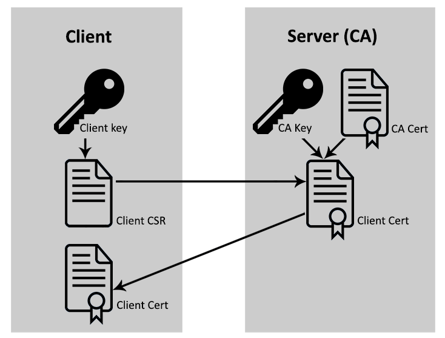

# X509 Client & Server based 2 way SSL communication based on CSR, CERT and
CA




## Step 1, generate server key

```
openssl genrsa -aes256 -out serverprivate.key 2048
```

Password is: 'changeit'

## Step 2, generate server CA

```
openssl req -x509 -new -nodes -key serverprivate.key -sha256 -days 1024 -out serverCA.crt
```

Password is: 'changeit'
CN is: 'localhost'

## Step 3, export server CA to JKS trust keystore

```
keytool -import -file serverCA.crt -alias serverCA -keystore truststore.jks
```

Fot keystore password use: 'changeit'

## Step 4, generate server keystore, same as trustore just in p12 format

```
openssl pkcs12 -export -in serverCA.crt -inkey serverprivate.key -certfile serverCA.crt -out keystore.p12
```

Password is: 'changeit'

## Step 5, convert kexytore.p12 to keystore.jks, optional we don't use ths

```
keytool -importkeystore -srckeystore keystore.p12 -srcstoretype pkcs12 -destkeystore keystore.jks -deststoretype JKS
```

Password is: 'changeit'

## Step 6, generate a client key


```
openssl genrsa -aes256 -out clientprivate.key 2048
```

Password: 'client'

## Step 7, generate CSR Certificate Signing Request

```
openssl req -new -key clientprivate.key -out client.csr
```

The CN name: 'client' must match with auth.inMemoryAuthentication().withUser("client") given in auth config. (see CertSecurityConfig.java)


## Step 8, Sign CSR and generate Client Cert

```
openssl x509 -req -in client.csr -CA serverCA.crt -CAkey serverprivate.key -CAcreateserial -out client.crt -days 365 -sha256
```

You must provide server key password: 'changeit'

## Example:

```
curl -ik --cert client.crt --key clientprivate.key "https://localhost:8443/cert?name=clint"
```

Type the client cert password: 'client'

Output is:

```
Enter PEM pass phrase:
HTTP/1.1 200
X-Content-Type-Options: nosniff
X-XSS-Protection: 1; mode=block
Cache-Control: no-cache, no-store, max-age=0, must-revalidate
Pragma: no-cache
Expires: 0
Strict-Transport-Security: max-age=31536000 ; includeSubDomains
X-Frame-Options: DENY
Content-Type: text/plain;charset=UTF-8
Content-Length: 20
Date: Fri, 28 Dec 2018 20:41:36 GMT

Cert demo, Hi clint!
```

Another example, no cert name param provided

```
curl -ik --cert client.crt --key clientprivate.key "https://localhost:8443/cert"
```

Type the client cert password: 'client'

Output is:

```
Enter PEM pass phrase:
HTTP/1.1 200
X-Content-Type-Options: nosniff
X-XSS-Protection: 1; mode=block
Cache-Control: no-cache, no-store, max-age=0, must-revalidate
Pragma: no-cache
Expires: 0
Strict-Transport-Security: max-age=31536000 ; includeSubDomains
X-Frame-Options: DENY
Content-Type: text/plain;charset=UTF-8
Content-Length: 20
Date: Fri, 28 Dec 2018 20:58:42 GMT

Cert demo, Hi World!
```

Another example we don't provide client cert:

```
curl -ik "https://localhost:8443/cert"
```

Output is:

```
curl: (35) error:14094412:SSL routines:ssl3_read_bytes:sslv3 alert bad certificate
```